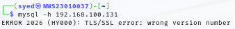
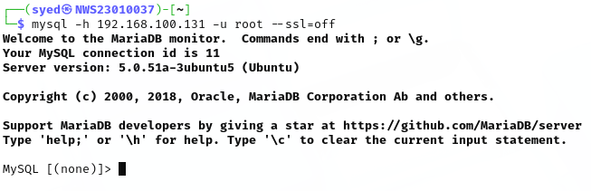
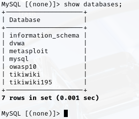
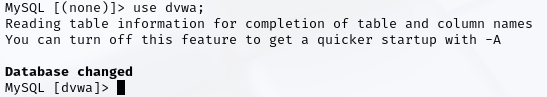
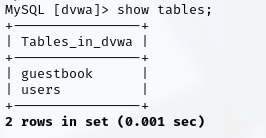
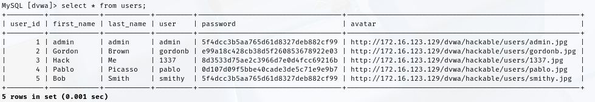
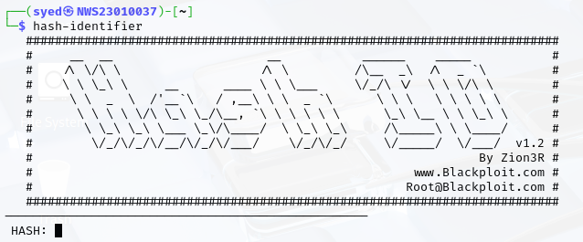
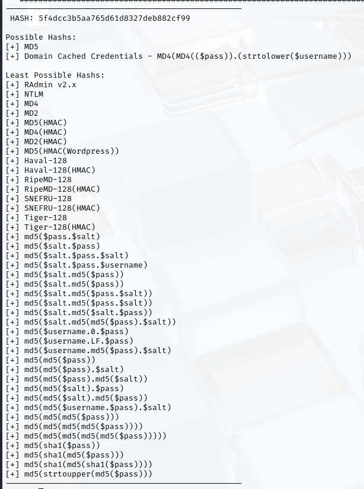

# Lab 2: Cracking Weak Password Hashes & Exploiting Poor Authentication

*Time Allocated: 3 Hours
Total Marks: 15* 

## OBJECTIVES
1. Find and exploit weak crypto in database login and password storage.

2. Do offline cracking of password hashes found in the database.

3. Learn from real-world crypto mistakes and suggest better ways.

4. Write a report in GitHub (Markdown) and show a short demo.

## LAB TASK
### 1. Service enumeration and initial access
I try to connect to the database using:

 ```bash 
 my sql -h 192.168.100.131
 ```
but it shows error ><



**WHY DOES THIS HAPPEN?**

This is because  MySQL Server  enforcing SSL/TLS, but the client and server disagree on the encryption protocol version.

**HOW TO FIX IT?**

we need to disabled SSL so we can make a connection. Use:

```bash
mysql -h 192.168.100.131 -u root --ssl=off
```
*by doing this we have disable SSL and bypasses the error but our credentials are not secured as it is not encrypted*



### 2. USER ENUMERATION AND WEAK AUTHENTICATION

next step is to gte the information about the database using:

```bash
show databases;
```


*here we can see the dvwa which are vulnerable*

so we will be needing to look trough dvwa table using:

```bash 
use dvwa;
```



we will need to list the table so use:

```bash
show tables;
```



*as we found user's database now we can use it*

try too look for passwords in users database using:

```bash
select * from users;
```



*From this output we can crack the password that we choose.In this case i choose admin's passwords which is:*

```bash
5f4dcc3b5aa765d61d8327deb882cf99
```

Now lets try to figure out what kind of hash is that.

### 3. PASSWORD HASH DISCOVERY AND HASH IDENTIFICATION

we will be using hash-identifier tool. To open it using kali type :

```bash 
hash-identifier
```




enter the hash and we will get the result !!




4. CRACK THE PASSWORD


create file hash.txt and paste the hash in it. Use :
```
echo "5f4dcc3b5aa765d61d8327deb882cf99">hash.txt  
```


Then we will need to crack it using john the reaper. Use:


```
john --format=raw-md5 --wordlist=/usr/share/wordlists/rockyou.txt hash.txt

```


fnally now we can show the password using:

```
john --show --format=raw-md5 hash.txt 
```


