# Lab 2: Cracking Weak Password Hashes & Exploiting Poor Authentication

*Time Allocated: 3 Hours  
Total Marks: 15* 

## OBJECTIVES
1. Find and exploit weak crypto in database login and password storage.
2. Do offline cracking of password hashes found in the database.
3. Learn from real-world crypto mistakes and suggest better ways.
4. Write a report in GitHub (Markdown) and show a short demo.

---

## LAB TASK

### 1. Service Enumeration and Initial Access

To begin, we perform an Nmap scan to identify open ports on the target system:

```bash
nmap -sS -sV -p- 192.168.100.131
```

> This scan reveals that **MySQL is running on port 3306**, indicating that the server is potentially accessible.

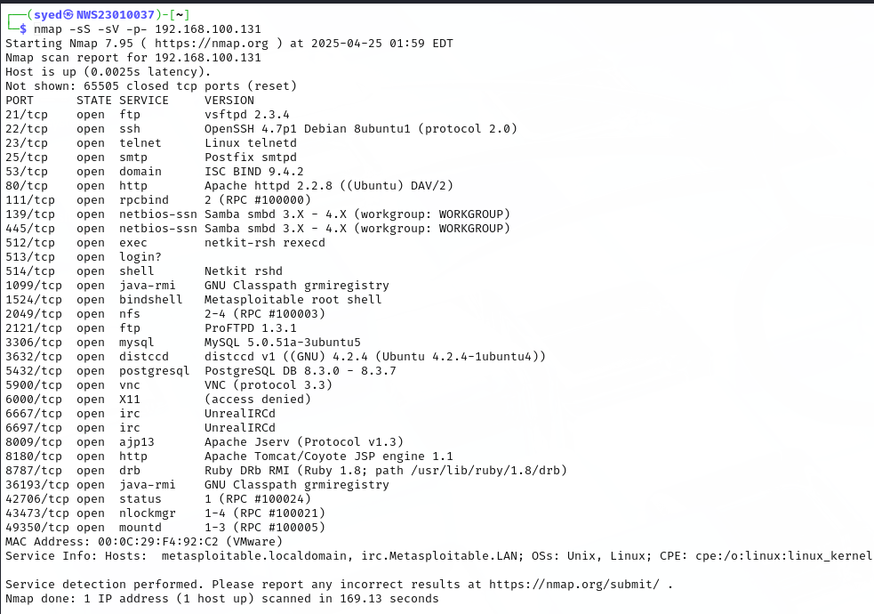

We attempt to connect to the MySQL server using:

```bash
mysql -h 192.168.100.131
```

This results in a connection error:

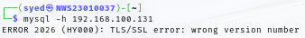

**Why does this happen?**  
The error occurs because the **MySQL server enforces SSL/TLS**, but the default client does not support or negotiate the required encryption protocol.

**How to fix it?**  
We bypass the SSL requirement using the following command:

```bash
mysql -h 192.168.100.131 -u root --ssl=off
```

> ⚠️ By disabling SSL, the connection is successful but **not encrypted**, meaning credentials are exposed during transmission.

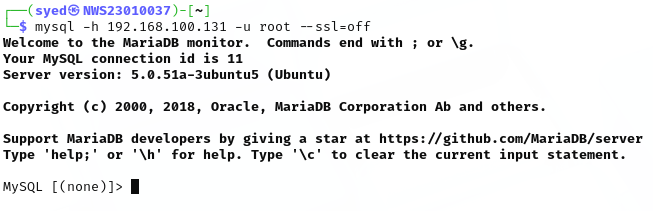

---

### 2. User Enumeration and Weak Authentication

After successfully accessing the MySQL server, we begin database enumeration:

```bash
show databases;
```

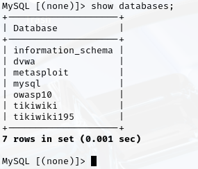

We switch to the vulnerable `dvwa` database:

```bash
use dvwa;
```

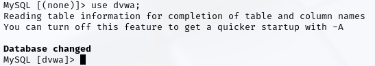

List tables in the selected database:

```bash
show tables;
```

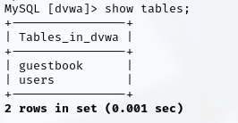

Inspect the `users` table to find usernames and password hashes:

```bash
select * from users;
```

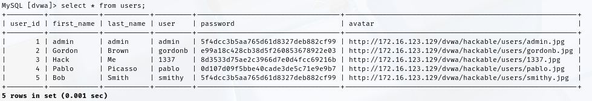

From the output, we identify a **hashed password for the `admin` user**:

```text
5f4dcc3b5aa765d61d8327deb882cf99
```

---

### 3. Hash Type Identification

We identify the hash type using the tool `hash-identifier`:

```bash
hash-identifier
```

Enter the hash and observe the result:

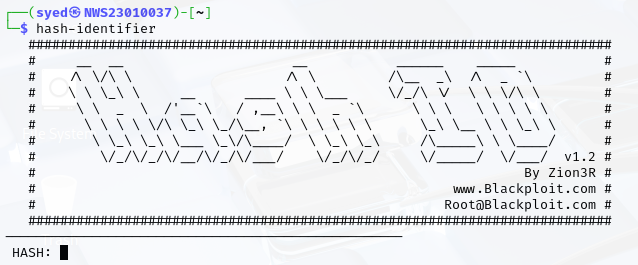  
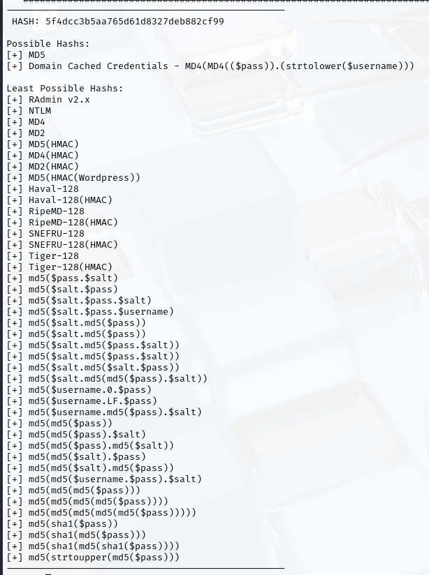

> The tool identifies it as **MD5**, a widely used but insecure hashing algorithm.

---

### 4. Cracking the Password

We create a file to store the hash:

```bash
echo "5f4dcc3b5aa765d61d8327deb882cf99" > hash.txt
```

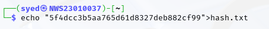

Use **John the Ripper** to crack it with the popular RockYou wordlist:

```bash
john --format=raw-md5 --wordlist=/usr/share/wordlists/rockyou.txt hash.txt
```

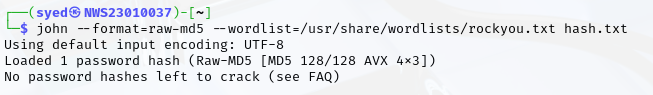

Finally, view the cracked password:

```bash
cat ~/.john/john.pot
```


> ✅ The password for the `admin` user is revealed to be: **password**

---

### 5. Cryptographic Analysis and Mitigation

- **Weakness 1: MD5 Hashes** — MD5 is outdated and fast to compute, making it vulnerable to brute-force and rainbow table attacks.
- **Weakness 2: Unencrypted Connection** — Disabling SSL for MySQL connections exposes login credentials to sniffing attacks.
- **Weakness 3: Weak Password** — Simple passwords like `password` are trivial to crack and should never be used.

**Recommendations:**
- Use stronger hashing algorithms like **bcrypt**, **scrypt**, or **Argon2**.
- Always enforce **TLS/SSL** for database connections.
- Enforce **strong password policies** and implement **multi-factor authentication**.

---

## Conclusion

This lab demonstrated how **weak password hashes, poor authentication, and lack of encryption** can be exploited by attackers. By identifying and cracking a weak MD5 hash and bypassing SSL requirements, we successfully extracted sensitive credentials. This highlights the importance of adopting **modern cryptographic standards** and **secure coding practices** to protect systems from real-world threats.