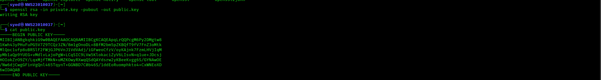

# Lab 3: Hands-on Exploration of Cryptographic Tools: Hashing, Encryption, and Digital Signature

in this lab we will be introduced to openSSL which is a cryptography toolkit.We will be performing essential cryptographic operations such as :

- Symmetric encryption(AES)
- Asymmetric encryption (RSA)
- Hashing (SHA-256)
- Digital signatures (RSA with SHA-256)

after you follow me step by step on this labwork,you will be able to :
- Encrypt and decrypt files using symmetric and asymmetric encryption.
- Generate and verify hashes for data integrity.
- Create and verify digital signatures.


 **NOW LETS START** 💪


## **Task 1: Symmetric Encryption using AES**

**Objective: Encrypt and decrypt a file using AES-256 in CBC mode**

**STEPS:**

### 1. create a .txt file fill with any text that you want to encrypt
 
**command:**
```bash
 echo "your.text">filename.txt
```

*replace your.text and filename on your own. Refer the screenshot if you are confuse on how to replace the command. Please take not that This apply to entire of  labwork proccess.If you still dont get it then it is a skill isues ><*

**example:**


###  2. encrypt the file using AES-256-CBC.

**command:**
```bash
 openssl enc -aes-256-cbc -salt -in filename.txt -out filename.txt.enc
```

**example:**


###  3. Decrypt the file

**command:**
```bash
openssl enc -aes-256-cbc -d -in filename.txt.enc -out filename.txt

```

**example:**


### 4.  Verify the decrypted content matches the original

**command:**
```bash
cat filename.txt
cat filename.txt
```

**example:**


## **Task 2: Asymmetric Encryption using RSA**

**Objective: Generate an RSA key pair, encrypt a message with the public key, and decrypt it with the private key.**


**STEPS:**

### 1. Generate an RSA private key (2048-bit)

**command:**
```bash
openssl genpkey -algorithm RSA -out filename -pkeyopt rsa_keygen_bits:2048
```

**example:**


### 2. Extract the public key

**command:**
```bash
 openssl rsa -in filename -pubout -out filename

```

**example:**




### 3. Encrypt a message using the public key

**command:**
```bash
 openssl pkeyutl -encrypt -inkey filename -pubin -in filename -out filename       
```

**example:**


### 4. Decrypt using the private key

**command:**
```bash
   openssl pkeyutl -decrypt -inkey filename -in filename -out filename
```

**example:**


### 5. Verify the decrypted message matches the original.

**command:**
```bash
   diff gymbro.txt rsa.dec.file
```
*if there is nothing came out then it matches but if it is not match then the different will be shown.*


**example:**

*if it is match: *


*if it doesn't match:*

