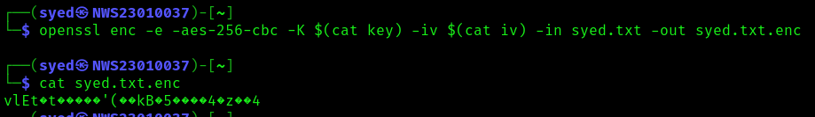
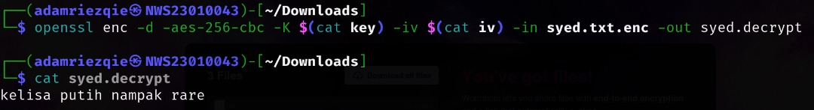
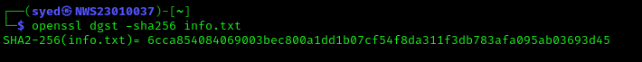

# Lab 3: Hands-on Exploration of Cryptographic Tools: Hashing, Encryption, and Digital Signature

in this lab we will be introduced to openSSL which is a cryptography toolkit.We will be performing essential cryptographic operations such as :

- Symmetric encryption(AES)
- Asymmetric encryption (RSA)
- Hashing (SHA-256)
- Digital signatures (RSA with SHA-256)

after you follow me step by step on this labwork,you will be able to :
- Encrypt and decrypt files using symmetric and asymmetric encryption.
- Generate and verify hashes for data integrity.
- Create and verify digital signatures.


 **NOW LETS START** 💪


## **Task 1: Symmetric Encryption using AES**

**Objective: Encrypt and decrypt a file using AES-256 in CBC mode**

**STEPS:**

### 1. create a .txt file fill with any text that you want to encrypt
 
**command:**
```bash
 echo "your.text">filename.txt
```

*replace your.text and filename on your own. Refer the screenshot if you are confuse on how to replace the command. Please take not that This apply to entire of  labwork proccess.If you still dont get it then it is a skill isues ><*

**example:**

```bash
┌──(syed㉿NWS23010037)-[~]
└─$ echo "kelisa putih nampak rare" > "syed.txt"

```


###  2. generate key and iv

**command:**
```bash
openssl rand -hex 32 > filename
openssl rand -hex 16 > filename
```

**example:**

```bash
┌──(syed㉿NWS23010037)-[~]
└─$ openssl rand -hex 32 > key

┌──(syed㉿NWS23010037)-[~]
└─$ openssl rand -hex 16 > iv

┌──(syed㉿NWS23010037)-[~]
└─$ cat key iv
595369a67de06fa9619e2cab404180e958e07dc258423b6509b11dfd4c4aa8f3
bac6130b2c33397a5afbf851cfd0acb9

```


###  3. encrypt the file using AES-256-CBC.

**command:**
```bash
openssl enc -e -aes-256-cbc -K $(cat key) -iv $(cat iv) -in filename -out filename.enc

```

**example:**


```bash
┌──(syed㉿NWS23010037)-[~]
└─$ openssl enc -e -aes-256-cbc -K $(cat key) -iv $(cat iv) -in syed.txt -out syed.txt.enc

┌──(syed㉿NWS23010037)-[~]
└─$ cat syed.txt.enc 
vlEt�t�����'(��kB�5����4�z��4

```



###  4. Decrypt the file

**command:**
```bash
openssl enc -e -aes-256-cbc -K $(cat filename) -iv $(cat filename) -in filename -out filename

```

**example:**
```bash
┌──(adamriezqie㉿NWS23010043)-[~/Downloads]
└─$ openssl enc -d -aes-256-cbc -K $(cat key) -iv $(cat iv) -in syed.txt.enc -out syed.decrypt
                                                                                                         
┌──(adamriezqie㉿NWS23010043)-[~/Downloads]
└─$ cat syed.decrypt
kelisa putih nampak rare

```



### 5.  Verify the decrypted content matches the original

**command:**
```bash
cat filename.txt filename.txt.decrypt

```

**example:**


```bash
┌──(syed㉿NWS23010037)-[~]
└─$ ll syed.txt syed.decrypt
-rw-rw-r-- 1 syed syed 25 May  2 00:53 syed.decrypt
-rw-rw-r-- 1 syed syed 25 May  2 00:05 syed.txt                                                                                                                        
┌──(syed㉿NWS23010037)-[~]                                       
└─$ diff syed.txt syed.decrypt 
                                                                                                                                                                                                    
┌──(syed㉿NWS23010037)-[~]                                      
└─$                                                                                                                                     
                
```


## **Task 2: Asymmetric Encryption using RSA**

**Objective: Generate an RSA key pair, encrypt a message with the public key, and decrypt it with the private key.**


**STEPS:**

### 1. Generate an RSA private key (2048-bit)

**command:**
```bash
openssl genpkey -algorithm RSA -out filename -pkeyopt rsa_keygen_bits:2048
```

**example:**


### 2. Extract the public key

**command:**
```bash
 openssl rsa -in filename -pubout -out filename

```

**example:**


### 3. Encrypt a message using the public key

**command:**
```bash
 openssl pkeyutl -encrypt -inkey filename -pubin -in filename -out filename       
```

**example:**


### 4. Decrypt using the private key

**command:**
```bash
   openssl pkeyutl -decrypt -inkey filename -in filename -out filename
```

**example:**


### 5. Verify the decrypted message matches the original.

**command:**
```bash
   diff filename.txt filname.txt.decrypt
```
*if there is nothing came out then it matches but if it is not match then the different will be shown.*


**example:**

*if it is match:*


*if it doesn't match:*


## **Task 3:  Hashing and Message Integrity using SHA-256**

**Objective: Generate a hash of a file and verify its integrity.**


**STEPS:**

### 1. Create a sample file

**command:**
```bash
echo "anything" > filename
```

**example:**


### 2. Generate SHA-256 hash

**command:**
```bash
openssl dgst -sha256 filename
```

**example:**



### 3. Modify the file slightly 

**command:**

```bash
echo "anything" > filename
```

**example:**


### 4. regenerate the hash and check it

**command:**

```bash
openssl dgst -sha256 filename
```

**example:**


## **Task 4:  Digital Signatures using RSA & SHA-256**

**Objective: Sign a file and verify the signature.**


**STEPS:**

### 1. Sign the file using Private Key

**command:**
```bash
openssl dgst -sha256 -sign filename -out filename filename
```

**example:**


### 2. Verify the Signature using Public Key

**command:**
```bash
openssl dgst -sha256 -verify filename -signature filename.sign filename
```

**example:**


### 3. Tamper the file

**command:**
```bash
echo "anything" > filename
```

**example:**


### 4. Verify again

**command:**
```bash
openssl dgst -sha256 -verify filename -signature filename filename

```

**example:**


